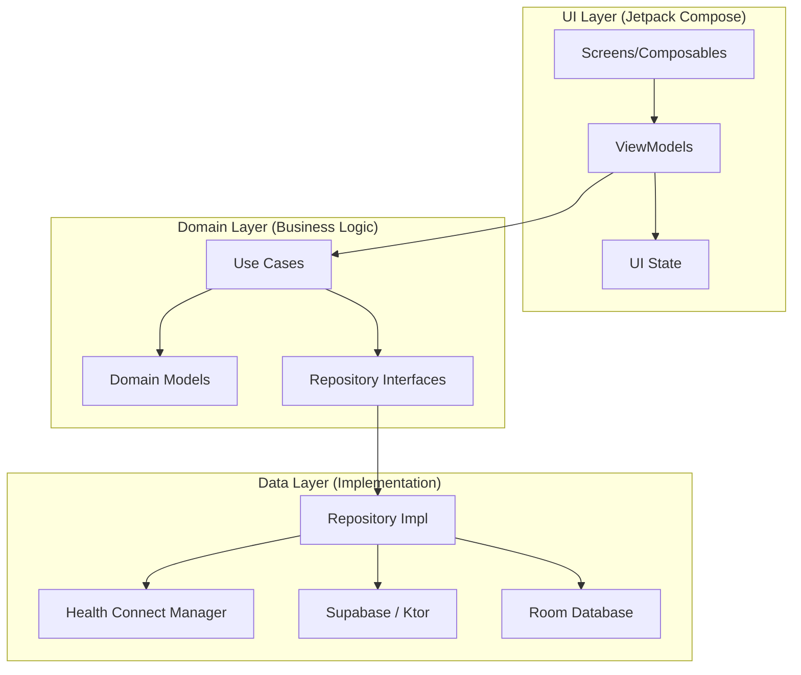

# 🌿 HelloHealth

[](https://developer.android.com)
[](https://kotlinlang.org)
[](https://developer.android.com/jetpack/compose)
[](https://developer.android.com/health-and-fitness/guides/health-connect)
[](https://supabase.com/)

**HelloHealth** is a premier, privacy-centric health and fitness ecosystem for Android. Designed for the modern user, it transforms fragmented health data into a unified, actionable, and visually stunning experience. By leveraging the **Android Health Connect SDK**, HelloHealth aggregates metrics from diverse wearables and apps, providing deep insights without compromising user privacy.

---

## ✨ Key Features

### 🏥 Unified Health Intelligence
*   **Centralized Dashboard**: A comprehensive overview of daily steps, calorie expenditure, and active duration.
*   **Health Connect Sync**: Bi-directional synchronization with the Android health ecosystem, ensuring your data is never siloed.

### 📊 Deep Workout Analytics
*   **Interactive Sessions**: Detailed breakdown of every workout with interactive time-series charts.
*   **Performance Metrics**: Track Heart Rate, Pace, and Elevation profiles with scrubbable graph indicators.
*   **Geospatial Tracking**: Visualized workout routes powered by **Google Maps**, showing start/finish markers and path geometry.

### 🧠 Intelligent Insights
*   **Weekly Trends**: Comparative analysis of your performance against previous weeks.
*   **Data-Driven Feedback**: Visual indicators for activity trends (increasing/decreasing) across various health markers.

### 👤 Personalized Wellness
*   **Dynamic Goal Setting**: Fine-tune your daily targets for steps, calories, and active minutes with intuitive UI controls.
*   **Dietary Preferences**: Manage food preferences and nutritional focus areas (e.g., Protein-rich, Low-carb).
*   **Secure Identity**: Frictionless onboarding via **Google Identity** and **Android Credential Manager**.

---

## 🏗 Technical Architecture

HelloHealth is engineered with a strict adherence to **Clean Architecture** and **SOLID** principles, ensuring the codebase is modular, testable, and maintainable.



### 🛠 Tech Stack
*   **Core**: [Kotlin](https://kotlinlang.org/) (Coroutines, Flow, Serialization)
*   **UI Framework**: [Jetpack Compose](https://developer.android.com/jetpack/compose) (Material 3, Dynamic Color)
*   **Navigation**: [Compose Navigation](https://developer.android.com/jetpack/compose/navigation) with Type-safe arguments.
*   **Dependency Injection**: [Hilt](https://developer.android.com/training/dependency-injection/hilt-android)
*   **Persistence**: [Room](https://developer.android.com/training/data-storage/room) for offline-first caching.
*   **Backend**: [Supabase](https://supabase.com/) (Auth, Postgrest)
*   **Health Integration**: [Health Connect SDK](https://developer.android.com/health-and-fitness/guides/health-connect)
*   **Maps**: [Google Maps Compose SDK](https://github.com/googlemaps/android-maps-compose)
*   **Image Loading**: [Coil](https://coil-kt.github.io/coil/)

---

## 📸 UI Showcase

| Dashboard | Workout Analytics | Health Insights |
| :---: | :---: | :---: |
|  |  |  |

---

## 🚀 Getting Started

### Prerequisites
*   **Android Studio Ladybug** (or newer)
*   **JDK 17**
*   **Health Connect** installed on the device (Standard on Android 14+, available on Play Store for 9-13)

### Setup Instructions

1.  **Clone the Repository**
    ```bash
    git clone https://github.com/Pranay-AntiGravity/HelloHealth.git
    ```

2.  **Environment Configuration**
    Create a `local.properties` file in the root directory:
    ```properties
    SUPABASE_URL=https://your-project.supabase.co
    SUPABASE_ANON_KEY=your-anon-key
    GOOGLE_WEB_CLIENT_ID=your-google-client-id.apps.googleusercontent.com
    GOOGLE_MAPS_API_KEY=your-maps-api-key
    ```

3.  **Google Cloud Platform Setup**
    *   Enable **Google Maps SDK for Android**.
    *   Configure **Google Sign-In** and obtain the Web Client ID for Credential Manager integration.

4.  **Health Connect Permissions**
    Upon first launch, the app will request read/write access to various health data types. Ensure these are granted for full functionality.

---

## 🗺 Roadmap

-   [x] **Core Health Connect Integration**
-   [x] **Interactive Workout Charts & Maps**
-   [x] **Weekly Insight Engine**
-   [ ] **🥗 Nutrition Tracking**: Direct logging of macro/micronutrients.
-   [ ] **🤖 AI Coaching**: Personalized health advice using LLM-based analysis of activity data.
-   [ ] **⌚ Wear OS Companion**: Standalone tracking for watches.

---

## 📄 License

Copyright (c) 2024 HelloHealth Team.
Licensed under the [MIT License](LICENSE).

---
*Developed with 💚 by the HelloHealth Team.*
